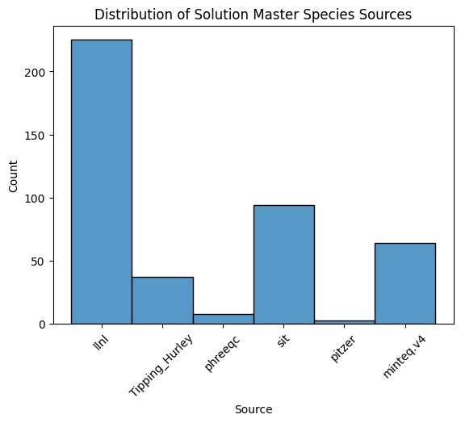
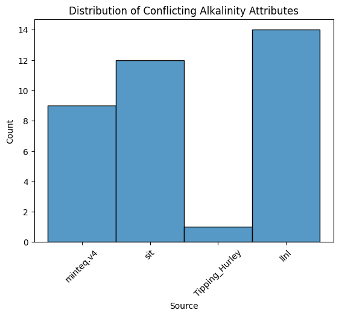
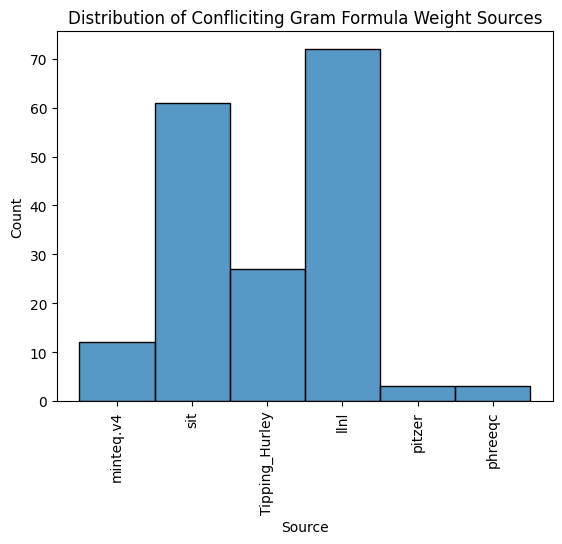
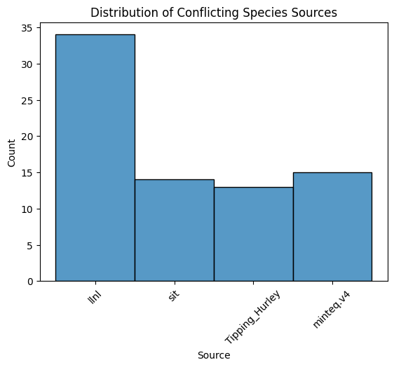
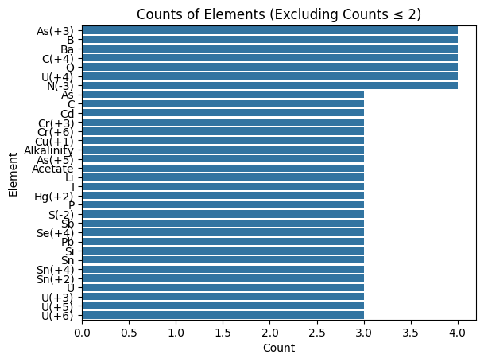

## $Results$ Table of Contents
- [Introduction](#introduction)
- [Preview DataFrames](#examine-dataframes)
  - [Examine Solution Master Species](#examine-solution-master-species)
    - [How many elements do each database have?](#how-many-elements-do-each-database-have)
    - [How often are elements defined differently?](#how-often-are-elements-defined-differently)
    - [Alkalinity Conflict](#alkalinity-conflict)

# Introduction
This directory examines the results of the [build_database](../build_database/) package. The pacakge is used to compile PHREEQC databases together and examine their stats. While some capabilites of the databases are shown (total number of Solution Master Species, total number of Solution Species equations) this directory focuses on conflicting information amoung databases.

## Terminology
PHREEQC databases use specific block test to define database sections and other specific words to define aspects of those blocks. A few are defined here for clarity of the following analysis.

This analysis concernes itself with two of PHREEQCS database blocks: **SOLUTION_MASTER_SPECIES** (SMS) and **SOLUTION_SPECIES** (SS). The SMS block is where elements and the equation representations are defined.There are two types of elements defined in the SMS block, Primay and Secondary SMSs. 

A Primary SMS is an element without an ionic charge, such as Ar. Every Primary SMS must be defined in the SS block with an identity equation, eg Ar = Ar with a log k value of 0.0. All other elements in the SMS block are Secondary SMS. These have an ionic charge, such as Al+3. Every Secondary SMS must be defined in the SS block as the first species to the left of the = in the SS equation field. An example would be

```
Ab + Cd = AbCd + H20
  log_k = 1.10
```
## Preview Data

### Solution Species

<table border="1" class="dataframe">
  <thead>
    <tr style="text-align: right;">
      <th></th>
      <th>equation</th>
      <th>log_k</th>
      <th>delta_h</th>
      <th>gamma</th>
      <th>d_w</th>
      <th>v_m</th>
      <th>millero</th>
      <th>activity_water</th>
      <th>add_logk</th>
      <th>co2_llnl_gamma</th>
      <th>erm_ddl</th>
      <th>no_check</th>
      <th>mole_balance</th>
      <th>source</th>
    </tr>
  </thead>
  <tbody>
    <tr>
      <th>0</th>
      <td>HAcetate =  HAcetate</td>
      <td>0.0</td>
      <td>(0, kJ/mol)</td>
      <td>None</td>
      <td>None</td>
      <td>None</td>
      <td>None</td>
      <td>None</td>
      <td>None</td>
      <td>None</td>
      <td>None</td>
      <td>False</td>
      <td>None</td>
      <td>llnl.dat</td>
    </tr>
    <tr>
      <th>1</th>
      <td>Ag+ =  Ag+</td>
      <td>0.0</td>
      <td>(0, kJ/mol)</td>
      <td>None</td>
      <td>None</td>
      <td>None</td>
      <td>None</td>
      <td>None</td>
      <td>None</td>
      <td>None</td>
      <td>None</td>
      <td>False</td>
      <td>None</td>
      <td>llnl.dat</td>
    </tr>
    <tr>
      <th>2</th>
      <td>Al+3 =  Al+3</td>
      <td>0.0</td>
      <td>(0, kJ/mol)</td>
      <td>None</td>
      <td>None</td>
      <td>None</td>
      <td>None</td>
      <td>None</td>
      <td>None</td>
      <td>None</td>
      <td>None</td>
      <td>False</td>
      <td>None</td>
      <td>llnl.dat</td>
    </tr>
    <tr>
      <th>3</th>
      <td>Am+3 =  Am+3</td>
      <td>0.0</td>
      <td>(0, kJ/mol)</td>
      <td>None</td>
      <td>None</td>
      <td>None</td>
      <td>None</td>
      <td>None</td>
      <td>None</td>
      <td>None</td>
      <td>None</td>
      <td>False</td>
      <td>None</td>
      <td>llnl.dat</td>
    </tr>
    <tr>
      <th>4</th>
      <td>Ar =  Ar</td>
      <td>0.0</td>
      <td>(0, kJ/mol)</td>
      <td>None</td>
      <td>None</td>
      <td>None</td>
      <td>None</td>
      <td>None</td>
      <td>None</td>
      <td>None</td>
      <td>None</td>
      <td>False</td>
      <td>None</td>
      <td>llnl.dat</td>
    </tr>
  </tbody>
</table>
</div>

### Master Solution Species


<table border="1" class="dataframe">
  <thead>
    <tr style="text-align: right;">
      <th></th>
      <th>element</th>
      <th>species</th>
      <th>alk</th>
      <th>gfw_formula</th>
      <th>element_gfw</th>
      <th>source</th>
    </tr>
  </thead>
  <tbody>
    <tr>
      <th>0</th>
      <td>Acetate</td>
      <td>HAcetate</td>
      <td>0.0</td>
      <td>Acetate</td>
      <td>59.</td>
      <td>#llnl.dat</td>
    </tr>
    <tr>
      <th>1</th>
      <td>Ag</td>
      <td>Ag+</td>
      <td>0.0</td>
      <td>Ag</td>
      <td>107.8682</td>
      <td>#llnl.dat</td>
    </tr>
    <tr>
      <th>2</th>
      <td>Ag(+1)</td>
      <td>Ag+</td>
      <td>0.0</td>
      <td>Ag</td>
      <td>None</td>
      <td>#llnl.dat</td>
    </tr>
    <tr>
      <th>3</th>
      <td>Ag(+2)</td>
      <td>Ag+2</td>
      <td>0.0</td>
      <td>Ag</td>
      <td>None</td>
      <td>#llnl.dat</td>
    </tr>
    <tr>
      <th>4</th>
      <td>Al</td>
      <td>Al+3</td>
      <td>0.0</td>
      <td>Al</td>
      <td>26.9815</td>
      <td>#llnl.dat</td>
    </tr>
  </tbody>
</table>
</div>


# Examine Solution Master Species

Let us take a closer look at the SMS database entries. How many elements does each database have?
    

    
LLNL has the most Primary and Secondary Master Solution Species defined, followed by  SIT. 


<table border="1" class="dataframe">
  <thead>
    <tr style="text-align: right;">
      <th></th>
      <th>element</th>
      <th>species</th>
      <th>alk</th>
      <th>gfw_formula</th>
      <th>element_gfw</th>
      <th>source</th>
    </tr>
  </thead>
  <tbody>
    <tr>
      <th>1</th>
      <td>Acetate</td>
      <td>Acetate-</td>
      <td>0.0</td>
      <td>Acetate</td>
      <td>59.01</td>
      <td>#sit.dat</td>
    </tr>
    <tr>
      <th>115</th>
      <td>Acetate</td>
      <td>Acetate-</td>
      <td>1.0</td>
      <td>59.045</td>
      <td>59.045</td>
      <td>#minteq.v4.dat</td>
    </tr>
    <tr>
      <th>0</th>
      <td>Acetate</td>
      <td>HAcetate</td>
      <td>0.0</td>
      <td>Acetate</td>
      <td>59.</td>
      <td>#llnl.dat</td>
    </tr>
    <tr>
      <th>1</th>
      <td>Ag</td>
      <td>Ag+</td>
      <td>0.0</td>
      <td>Ag</td>
      <td>107.8682</td>
      <td>#llnl.dat</td>
    </tr>
    <tr>
      <th>0</th>
      <td>Ag</td>
      <td>Ag+</td>
      <td>0.0</td>
      <td>107.868</td>
      <td>107.868</td>
      <td>#Tipping_Hurley.dat</td>
    </tr>
  </tbody>
</table>
</div>


With Acetate we can see that some databases have chosen to define elements differently. SIT and Minteq use de-protenated Acetate and LLNL uses the acidic form. This effects all equations in the Solutions Species table, as the log k values will be different based on the form used.

We can also see that even when two sources agree on the species definition, they can disagree on the alkalinity. SIT uses 0.0 for Acetate- while Minteq uses 1.0. They also disagree on the element's gram formula weight (gfw).

How often does this happen?

### Alkalinity Conflict


<table border="1" class="dataframe">
  <thead>
    <tr style="text-align: right;">
      <th></th>
      <th>element</th>
      <th>species</th>
      <th>alk</th>
      <th>source</th>
    </tr>
  </thead>
  <tbody>
    <tr>
      <th>115</th>
      <td>Acetate</td>
      <td>Acetate-</td>
      <td>1.0</td>
      <td>#minteq.v4.dat</td>
    </tr>
    <tr>
      <th>1</th>
      <td>Acetate</td>
      <td>Acetate-</td>
      <td>0.0</td>
      <td>#sit.dat</td>
    </tr>
    <tr>
      <th>0</th>
      <td>Alkalinity</td>
      <td>CO3-2</td>
      <td>2.0</td>
      <td>#minteq.v4.dat</td>
    </tr>
    <tr>
      <th>2</th>
      <td>Alkalinity</td>
      <td>CO3-2</td>
      <td>1.0</td>
      <td>#Tipping_Hurley.dat</td>
    </tr>
    <tr>
      <th>25</th>
      <td>Co(+3)</td>
      <td>Co+3</td>
      <td>-1.0</td>
      <td>#minteq.v4.dat</td>
    </tr>
    <tr>
      <th>53</th>
      <td>Co(+3)</td>
      <td>Co+3</td>
      <td>0.0</td>
      <td>#llnl.dat</td>
    </tr>
    <tr>
      <th>26</th>
      <td>Cr</td>
      <td>CrO4-2</td>
      <td>1.0</td>
      <td>#minteq.v4.dat</td>
    </tr>
    <tr>
      <th>54</th>
      <td>Cr</td>
      <td>CrO4-2</td>
      <td>0.0</td>
      <td>#llnl.dat</td>
    </tr>
    <tr>
      <th>56</th>
      <td>Cr(+3)</td>
      <td>Cr+3</td>
      <td>0.0</td>
      <td>#llnl.dat</td>
    </tr>
    <tr>
      <th>30</th>
      <td>Cr(+3)</td>
      <td>Cr+3</td>
      <td>-1.0</td>
      <td>#sit.dat</td>
    </tr>
    <tr>
      <th>31</th>
      <td>Cr(+6)</td>
      <td>CrO4-2</td>
      <td>1.0</td>
      <td>#sit.dat</td>
    </tr>
    <tr>
      <th>58</th>
      <td>Cr(+6)</td>
      <td>CrO4-2</td>
      <td>0.0</td>
      <td>#llnl.dat</td>
    </tr>
    <tr>
      <th>36</th>
      <td>Edta</td>
      <td>Edta-4</td>
      <td>0.0</td>
      <td>#sit.dat</td>
    </tr>
    <tr>
      <th>105</th>
      <td>Edta</td>
      <td>Edta-4</td>
      <td>2.0</td>
      <td>#minteq.v4.dat</td>
    </tr>
    <tr>
      <th>43</th>
      <td>Fe(+3)</td>
      <td>Fe+3</td>
      <td>0.0</td>
      <td>#sit.dat</td>
    </tr>
    <tr>
      <th>77</th>
      <td>Fe(+3)</td>
      <td>Fe+3</td>
      <td>-2.0</td>
      <td>#llnl.dat</td>
    </tr>
    <tr>
      <th>87</th>
      <td>Hf</td>
      <td>Hf+4</td>
      <td>0.0</td>
      <td>#llnl.dat</td>
    </tr>
    <tr>
      <th>48</th>
      <td>Hf</td>
      <td>Hf+4</td>
      <td>-4.0</td>
      <td>#sit.dat</td>
    </tr>
  </tbody>
</table>
</div>

We find 18 elements defined with different alkalinity attributes, all of which are shown above. Some differences are minor, plus or minus 1 alk unit. Other differences are quite large. Hf has a difference in alkalinity of four. Below we can see what databases are most often in conflict with others. LLNL lead with 14 conflicting alk values and SIT follows with 12.

    

    


### GFW Conflict


```python
gfw_dups_number, gfw_dups_df = alk_gfw_duplicates(sms, 'element_gfw')
print(f"{gfw_dups_number} elements defined with different gfw attributes")
gfw_dups_df.head()
```

    82 elements defined with different gfw attributes


<table border="1" class="dataframe">
  <thead>
    <tr style="text-align: right;">
      <th></th>
      <th>element</th>
      <th>species</th>
      <th>element_gfw</th>
      <th>source</th>
    </tr>
  </thead>
  <tbody>
    <tr>
      <th>115</th>
      <td>Acetate</td>
      <td>Acetate-</td>
      <td>59.045</td>
      <td>#minteq.v4.dat</td>
    </tr>
    <tr>
      <th>1</th>
      <td>Acetate</td>
      <td>Acetate-</td>
      <td>59.01</td>
      <td>#sit.dat</td>
    </tr>
    <tr>
      <th>0</th>
      <td>Ag</td>
      <td>Ag+</td>
      <td>107.868</td>
      <td>#Tipping_Hurley.dat</td>
    </tr>
    <tr>
      <th>1</th>
      <td>Ag</td>
      <td>Ag+</td>
      <td>107.8682</td>
      <td>#llnl.dat</td>
    </tr>
    <tr>
      <th>2</th>
      <td>Alkalinity</td>
      <td>CO3-2</td>
      <td>50.05</td>
      <td>#Tipping_Hurley.dat</td>
    </tr>
  </tbody>
</table>
</div>


```python
plot_source_hist(gfw_dups_df, 'Distribution of Confliciting Gram Formula Weight Sources', rotation=90)
```


    

    


### Species Conflict


```python
(sms.drop_duplicates(subset=['element', 'species']).groupby('element').nunique()['species'] > 1).sum()
```


    np.int64(35)


```python
species_dups = sms.drop_duplicates(subset=['element', 'species']).sort_values(by=['element'])
species_dups = species_dups[species_dups.duplicated(subset=['element'], keep=False)]
print(f"{species_dups['element'].nunique()} elements defined with different species")
species_dups.head()
```

    35 elements defined with different species


<table border="1" class="dataframe">
  <thead>
    <tr style="text-align: right;">
      <th></th>
      <th>element</th>
      <th>species</th>
      <th>alk</th>
      <th>gfw_formula</th>
      <th>element_gfw</th>
      <th>source</th>
    </tr>
  </thead>
  <tbody>
    <tr>
      <th>0</th>
      <td>Acetate</td>
      <td>HAcetate</td>
      <td>0.0</td>
      <td>Acetate</td>
      <td>59.</td>
      <td>#llnl.dat</td>
    </tr>
    <tr>
      <th>1</th>
      <td>Acetate</td>
      <td>Acetate-</td>
      <td>0.0</td>
      <td>Acetate</td>
      <td>59.01</td>
      <td>#sit.dat</td>
    </tr>
    <tr>
      <th>2</th>
      <td>Alkalinity</td>
      <td>CO3-2</td>
      <td>1.0</td>
      <td>50.05</td>
      <td>50.05</td>
      <td>#Tipping_Hurley.dat</td>
    </tr>
    <tr>
      <th>5</th>
      <td>Alkalinity</td>
      <td>HCO3-</td>
      <td>1.0</td>
      <td>Ca0.5(CO3)0.5</td>
      <td>50.05</td>
      <td>#llnl.dat</td>
    </tr>
    <tr>
      <th>12</th>
      <td>As</td>
      <td>AsO4-3</td>
      <td>0.0</td>
      <td>As</td>
      <td>74.9216</td>
      <td>#sit.dat</td>
    </tr>
  </tbody>
</table>
</div>


```python
plot_source_hist(species_dups, 'Distribution of Conflicting Species Sources')
```


    

    


### What elements are most often have conflicting definitions?


```python
element_counts = sms['element'].value_counts()
filtered_elements = element_counts[element_counts > 2].index
filtered_sms = sms[sms['element'].isin(filtered_elements)]
sorted_counts = filtered_sms['element'].value_counts().sort_values(ascending=False)
sns.barplot(y=sorted_counts.index, x=sorted_counts.values)
plt.xlabel('Count')
plt.ylabel('Element')
plt.title('Counts of Elements (Excluding Counts ≤ 2)')
plt.show()
```


    

    


## Examine Solution Species

### How many equations do each database have?


```python
plot_source_hist(solution_species, 'Distribution of Solution Species Sources', rotation=90)
```


    

    


### How many equations have conflicting log k values?


```python
(solution_species.groupby('equation').nunique() > 1).sum()
```


    log_k             155
    delta_h           112
    gamma              97
    d_w                 1
    v_m                 3
    millero             0
    activity_water      0
    add_logk            0
    co2_llnl_gamma      0
    erm_ddl             0
    no_check            0
    mole_balance        0
    source            246
    dtype: int64


This is a naive look at the number of conflicting values defined for each equation. There are 155 conflicting log K values amoung the databases, 122 conflicting delta h values, etc. Small differences in entry style or notation are missed with the method. Its difficult to guess every way an entry might be  different, but we can take a closer look at log_k as an example. Equations from different databases will have varying amounts of whitespace in the equation. Some databases use "floating point" representations of integers while others use only integers. SIT has three decimal precision for their floats, while LLNL has four. Both of these databases represent the implicit stockometric 1 with 1.000 or 1.0000. If we correct for some of these differeces in style, we can gather a few more equations that have conflicting log k values.


```python
import copy
equation_dups = copy.deepcopy(solution_species)
equation_dups.iloc[:,0] = equation_dups.iloc[:,0].str.replace(' ', '')
ones = re.compile(r'\b1(?!\d)')
equation_dups.iloc[:,0] = equation_dups.iloc[:,0].str.replace(ones, '', regex=True)
equation_dups = equation_dups.drop_duplicates(subset=['equation', 'log_k'])
equation_dups = equation_dups[equation_dups.duplicated(subset=['equation'], keep=False)].sort_values(by=['equation'])
equation_dups = equation_dups.drop(index=equation_dups[equation_dups['log_k'] == 0].index, axis=0) # remove rows with log k = 0
print(f"{equation_dups['equation'].nunique()} equations defined with different log k values")
print(f"{equation_dups['source'].value_counts()}")
equation_dups.sort_values(by=['equation']).head()
```

    302 equations defined with different log k values
    source
    minteq.v4.dat         226
    Tipping_Hurley.dat    169
    sit.dat               139
    llnl.dat              111
    phreeqc.dat            13
    pitzer.dat              5
    Name: count, dtype: int64


<table border="1" class="dataframe">
  <thead>
    <tr style="text-align: right;">
      <th></th>
      <th>equation</th>
      <th>log_k</th>
      <th>delta_h</th>
      <th>gamma</th>
      <th>d_w</th>
      <th>v_m</th>
      <th>millero</th>
      <th>activity_water</th>
      <th>add_logk</th>
      <th>co2_llnl_gamma</th>
      <th>erm_ddl</th>
      <th>no_check</th>
      <th>mole_balance</th>
      <th>source</th>
    </tr>
  </thead>
  <tbody>
    <tr>
      <th>1502</th>
      <td>2Cd+2+H2O=Cd2OH+3+H+</td>
      <td>-9.3900</td>
      <td>(10.9, kcal)</td>
      <td>None</td>
      <td>None</td>
      <td>None</td>
      <td>None</td>
      <td>None</td>
      <td>None</td>
      <td>None</td>
      <td>None</td>
      <td>False</td>
      <td>None</td>
      <td>Tipping_Hurley.dat</td>
    </tr>
    <tr>
      <th>3701</th>
      <td>2Cd+2+H2O=Cd2OH+3+H+</td>
      <td>-9.3970</td>
      <td>(45.81, kJ)</td>
      <td>(0, 0)</td>
      <td>None</td>
      <td>None</td>
      <td>None</td>
      <td>None</td>
      <td>None</td>
      <td>None</td>
      <td>None</td>
      <td>False</td>
      <td>None</td>
      <td>minteq.v4.dat</td>
    </tr>
    <tr>
      <th>306</th>
      <td>2Cd+2+H2O=Cd2OH+3+H+</td>
      <td>-9.3851</td>
      <td>(0,)</td>
      <td>None</td>
      <td>None</td>
      <td>None</td>
      <td>None</td>
      <td>None</td>
      <td>None</td>
      <td>None</td>
      <td>None</td>
      <td>False</td>
      <td>None</td>
      <td>llnl.dat</td>
    </tr>
    <tr>
      <th>2528</th>
      <td>2Cl-+Cr+3=CrCl2+</td>
      <td>-0.7100</td>
      <td>(20.920,)</td>
      <td>None</td>
      <td>None</td>
      <td>None</td>
      <td>None</td>
      <td>None</td>
      <td>None</td>
      <td>None</td>
      <td>None</td>
      <td>False</td>
      <td>None</td>
      <td>sit.dat</td>
    </tr>
    <tr>
      <th>385</th>
      <td>2Cl-+Cr+3=CrCl2+</td>
      <td>0.1596</td>
      <td>(41.2919, kJ/mol)</td>
      <td>None</td>
      <td>None</td>
      <td>None</td>
      <td>None</td>
      <td>None</td>
      <td>None</td>
      <td>None</td>
      <td>None</td>
      <td>False</td>
      <td>None</td>
      <td>llnl.dat</td>
    </tr>
  </tbody>
</table>
</div>


```python
range = equation_dups.groupby('equation')['log_k'].agg(lambda x: x.max() - x.min()).sort_values(ascending=False)
range
```


    equation
    3SO4-2+Zr+4=Zr(SO4)3-2    6.9993
    2SO4-2+Zr+4=Zr(SO4)2      5.2435
    H3AsO3=AsO3-3+3H+         4.8060
    HS-=S-2+H+                4.3820
    5F-+Zr+4=ZrF5-            4.2902
                               ...  
    H3BO3+F-=BF(OH)3-         0.0010
    Zn+2+4Cl-=ZnCl4-2         0.0010
    H++CO3-2=HCO3-            0.0010
    Cu+2+3HS-=Cu(HS)3-        0.0010
    Co+2+H++CO3-2=CoHCO3+     0.0001
    Name: log_k, Length: 302, dtype: float64


### Which equations have the most instances of different log k values?


```python
ed = equation_dups['equation'].value_counts().head(10)
```


```python
for equation in ed.index:
    print(equation)
    print(equation_dups[equation_dups['equation'] == equation][['log_k', 'source']])
```

    Pb+2+I-=PbI+
           log_k              source
    3077  1.9800             sit.dat
    1567  1.9400  Tipping_Hurley.dat
    895   1.9597            llnl.dat
    3915  2.0000       minteq.v4.dat
    Mn+2+Cl-=MnCl+
           log_k              source
    3872  0.1000       minteq.v4.dat
    1447  0.6100  Tipping_Hurley.dat
    2857  0.3000             sit.dat
    746   0.3013            llnl.dat
    Mn+2+F-=MnF+
          log_k              source
    2860   0.85             sit.dat
    1452   0.84  Tipping_Hurley.dat
    3798   1.60       minteq.v4.dat
    748    1.43            llnl.dat
    Pb+2+F-=PbF+
           log_k              source
    3074  2.2700             sit.dat
    1518  1.2500  Tipping_Hurley.dat
    3777  1.8480       minteq.v4.dat
    891   0.8284            llnl.dat
    Fe+3+F-=FeF+2
           log_k              source
    533   4.1365            llnl.dat
    2670  6.1300             sit.dat
    3795  6.0400       minteq.v4.dat
    1442  6.2000  Tipping_Hurley.dat
    Pb+2+Cl-=PbCl+
           log_k              source
    886   1.4374            llnl.dat
    3070  1.4400             sit.dat
    3828  1.5500       minteq.v4.dat
    1513  1.6000  Tipping_Hurley.dat
    Mg+2+F-=MgF+
           log_k              source
    729   1.3524            llnl.dat
    2831  1.8000             sit.dat
    3821  2.0500       minteq.v4.dat
    1376  1.8200  Tipping_Hurley.dat
    Na++F-=NaF
           log_k         source
    2889 -0.4500        sit.dat
    1944 -0.2400    phreeqc.dat
    772  -0.9976       llnl.dat
    3824 -0.2000  minteq.v4.dat
    Cd+2+Br-=CdBr+
           log_k              source
    3897  2.1500       minteq.v4.dat
    308   2.1424            llnl.dat
    2442  2.1600             sit.dat
    1561  2.1700  Tipping_Hurley.dat
    Ni+2+Cl-=NiCl+
           log_k              source
    1535  0.4000  Tipping_Hurley.dat
    2947  0.0800             sit.dat
    819  -0.9962            llnl.dat
    3865  0.4080       minteq.v4.dat

