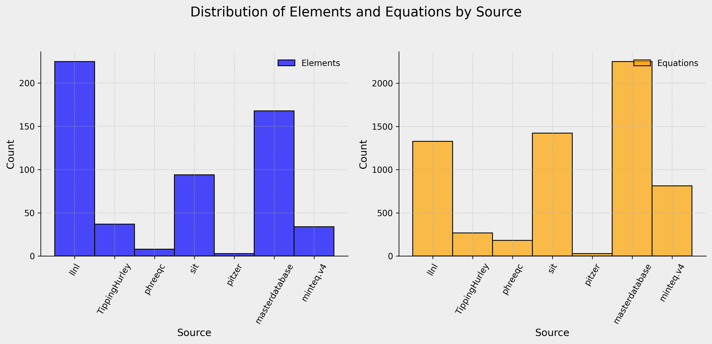
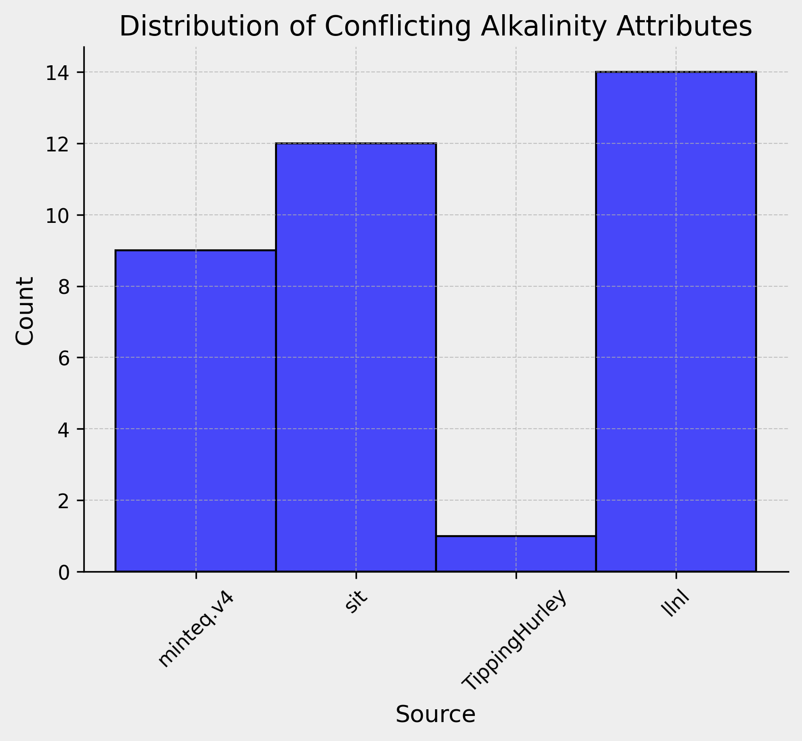
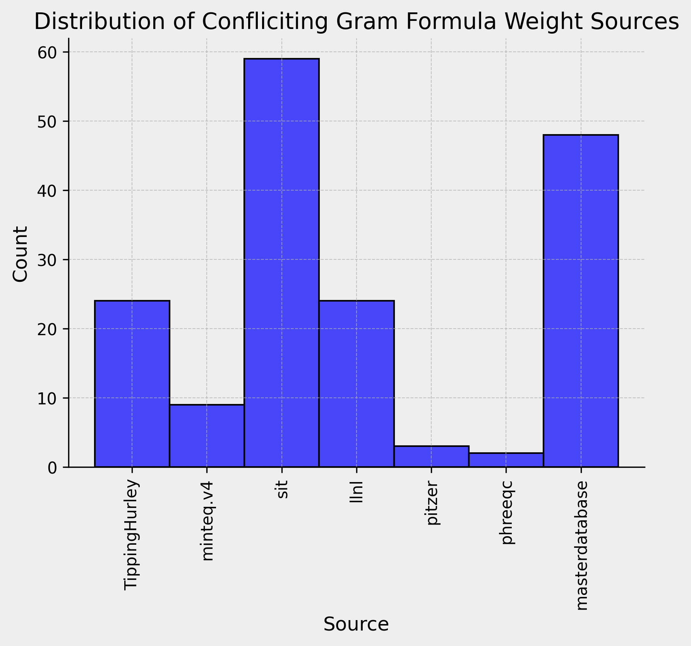
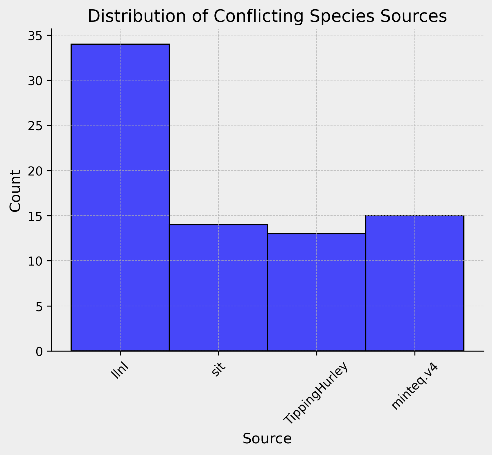
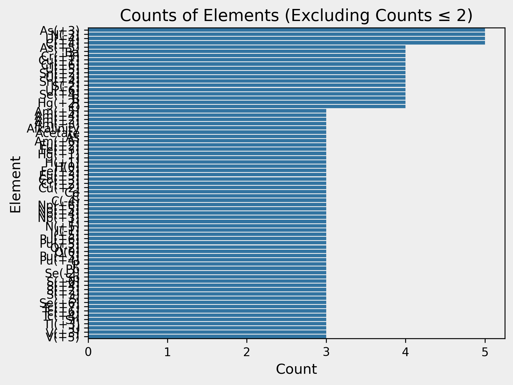
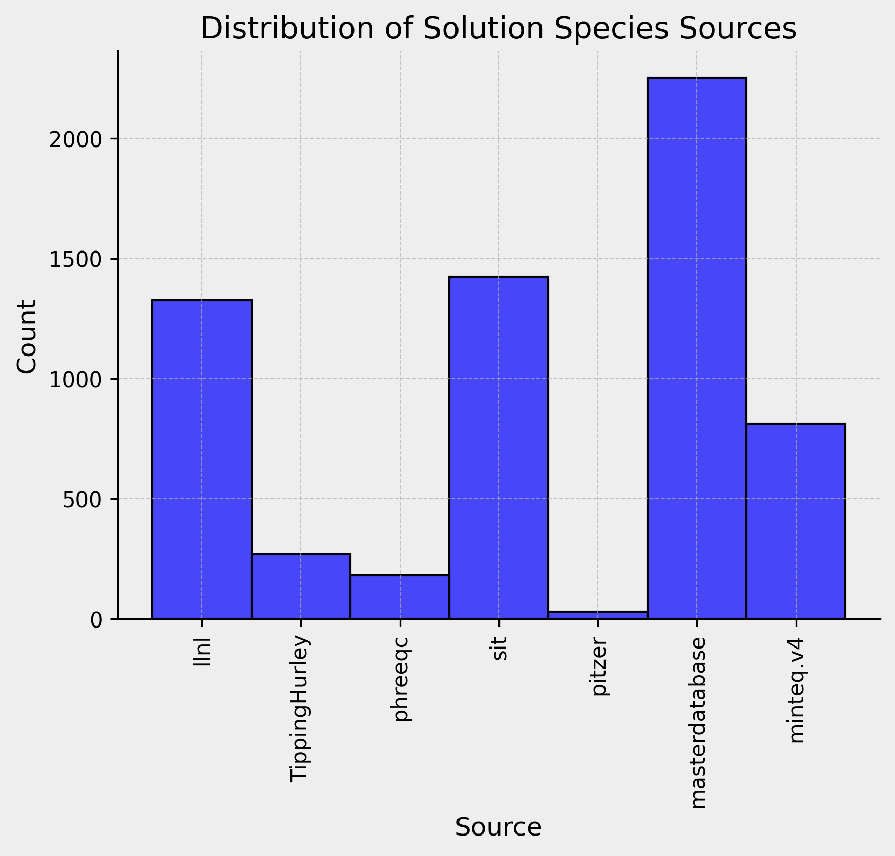

### Imports


```python
import warnings
import re
import pandas as pd
import seaborn as sns
import matplotlib.pyplot as plt
import build_database.clean_tables as ct
import build_database.utils as ut
import utils
import importlib.resources as pkg_resources
import build_database.databases

# automatically reaload update modules
%load_ext autoreload
%autoreload 2
```

    The autoreload extension is already loaded. To reload it, use:
      %reload_ext autoreload


### Setup


```python
# get databases folder from build_database
database_list = pkg_resources.files('build_database.databases')
database_list = ut.phreeqc_database_list(database_list)

# create Solution Species table
solution_species = ct.compile_solution_species_table(database_list)

# create Solution Master Species table
sms = ct.compile_master_solution_table(database_list, analysis=True)
# drop duplicate rows
before = len(sms)
filter_columns = ['element','species','alk','element_gfw']
sms = sms.drop_duplicates(subset=filter_columns)
after = len(sms)
print(f'Filtered {before - after} duplicate rows from Solution Master Species table')
before = len(solution_species)
filter_columns = solution_species.columns[:-1]
solution_species = solution_species.drop_duplicates(subset=filter_columns)
after = len(solution_species)
print(f'Filtered {before - after} duplicate rows from Solution Species table')
```

    Filtered 399 duplicate rows from Solution Master Species table
    Filtered 872 duplicate rows from Solution Species table


Examine DataFrames


```python
solution_species.head()
```


<div>
<style scoped>
    .dataframe tbody tr th:only-of-type {
        vertical-align: middle;
    }

    .dataframe tbody tr th {
        vertical-align: top;
    }

    .dataframe thead th {
        text-align: right;
    }
</style>
<table border="1" class="dataframe">
  <thead>
    <tr style="text-align: right;">
      <th></th>
      <th>equation</th>
      <th>log_k</th>
      <th>delta_h</th>
      <th>gamma</th>
      <th>d_w</th>
      <th>v_m</th>
      <th>millero</th>
      <th>activity_water</th>
      <th>add_logk</th>
      <th>co2_llnl_gamma</th>
      <th>erm_ddl</th>
      <th>no_check</th>
      <th>mole_balance</th>
      <th>source</th>
    </tr>
  </thead>
  <tbody>
    <tr>
      <th>0</th>
      <td>HAcetate =  HAcetate</td>
      <td>0.0</td>
      <td>(0, kJ/mol)</td>
      <td>None</td>
      <td>None</td>
      <td>None</td>
      <td>None</td>
      <td>None</td>
      <td>None</td>
      <td>None</td>
      <td>None</td>
      <td>False</td>
      <td>None</td>
      <td>llnl.dat</td>
    </tr>
    <tr>
      <th>1</th>
      <td>Ag+ =  Ag+</td>
      <td>0.0</td>
      <td>(0, kJ/mol)</td>
      <td>None</td>
      <td>None</td>
      <td>None</td>
      <td>None</td>
      <td>None</td>
      <td>None</td>
      <td>None</td>
      <td>None</td>
      <td>False</td>
      <td>None</td>
      <td>llnl.dat</td>
    </tr>
    <tr>
      <th>2</th>
      <td>Al+3 =  Al+3</td>
      <td>0.0</td>
      <td>(0, kJ/mol)</td>
      <td>None</td>
      <td>None</td>
      <td>None</td>
      <td>None</td>
      <td>None</td>
      <td>None</td>
      <td>None</td>
      <td>None</td>
      <td>False</td>
      <td>None</td>
      <td>llnl.dat</td>
    </tr>
    <tr>
      <th>3</th>
      <td>Am+3 =  Am+3</td>
      <td>0.0</td>
      <td>(0, kJ/mol)</td>
      <td>None</td>
      <td>None</td>
      <td>None</td>
      <td>None</td>
      <td>None</td>
      <td>None</td>
      <td>None</td>
      <td>None</td>
      <td>False</td>
      <td>None</td>
      <td>llnl.dat</td>
    </tr>
    <tr>
      <th>4</th>
      <td>Ar =  Ar</td>
      <td>0.0</td>
      <td>(0, kJ/mol)</td>
      <td>None</td>
      <td>None</td>
      <td>None</td>
      <td>None</td>
      <td>None</td>
      <td>None</td>
      <td>None</td>
      <td>None</td>
      <td>False</td>
      <td>None</td>
      <td>llnl.dat</td>
    </tr>
  </tbody>
</table>
</div>


```python
sms.head()
```


<div>
<style scoped>
    .dataframe tbody tr th:only-of-type {
        vertical-align: middle;
    }

    .dataframe tbody tr th {
        vertical-align: top;
    }

    .dataframe thead th {
        text-align: right;
    }
</style>
<table border="1" class="dataframe">
  <thead>
    <tr style="text-align: right;">
      <th></th>
      <th>element</th>
      <th>species</th>
      <th>alk</th>
      <th>gfw_formula</th>
      <th>element_gfw</th>
      <th>source</th>
    </tr>
  </thead>
  <tbody>
    <tr>
      <th>0</th>
      <td>Acetate</td>
      <td>HAcetate</td>
      <td>0.0</td>
      <td>Acetate</td>
      <td>59.</td>
      <td>#llnl.dat</td>
    </tr>
    <tr>
      <th>1</th>
      <td>Ag</td>
      <td>Ag+</td>
      <td>0.0</td>
      <td>Ag</td>
      <td>107.8682</td>
      <td>#llnl.dat</td>
    </tr>
    <tr>
      <th>2</th>
      <td>Ag(+1)</td>
      <td>Ag+</td>
      <td>0.0</td>
      <td>Ag</td>
      <td>None</td>
      <td>#llnl.dat</td>
    </tr>
    <tr>
      <th>3</th>
      <td>Ag(+2)</td>
      <td>Ag+2</td>
      <td>0.0</td>
      <td>Ag</td>
      <td>None</td>
      <td>#llnl.dat</td>
    </tr>
    <tr>
      <th>4</th>
      <td>Al</td>
      <td>Al+3</td>
      <td>0.0</td>
      <td>Al</td>
      <td>26.9815</td>
      <td>#llnl.dat</td>
    </tr>
  </tbody>
</table>
</div>


## Database Overview 

### How much data does each database have?


```python
plt.rcParams.update({
    'font.size': 12,
    'font.family': 'sans-serif',
    'font.sans-serif': ['DejaVu Sans'],
    'axes.titlesize': 14,
    'axes.labelsize': 12,
    'figure.facecolor': '#eeeeee',
    'axes.facecolor': '#eeeeee',
    'xtick.labelsize': 10,
    'ytick.labelsize': 10,
    'legend.fontsize': 10,
    'figure.dpi': 300  # High resolution for publication
})


# Create a figure with 1 row and 2 columns for side-by-side subplots
fig, (ax1, ax2) = plt.subplots(1, 2, figsize=(12, 6))

# Add a title for the entire figure
fig.suptitle('Distribution of Elements and Equations by Source', fontsize=16)

# Plot the first histogram on the first subplot
utils.plot_source_hist(sms, ax=ax1, rotation=60, color='blue', label='Elements')

# Plot the second histogram on the second subplot
utils.plot_source_hist(solution_species, ax=ax2, rotation=60, color='orange', label='Equations')

# Adjust layout to prevent overlap of subplot titles and labels
plt.tight_layout(rect=[0, 0.03, 1, 0.95])  # Adjust rect to make room for the suptitle

# Save the figure with both subplots in high resolution
fig.savefig('subplots_combined.png', format='png', bbox_inches='tight', dpi=300)

plt.show()

```


    

    


What is the ratio of elements to sources?


```python
# group by source and count the number of unique elements
source_element_counts = sms.groupby('source')['element'].nunique()
source_element_counts = source_element_counts.reset_index()
source_element_counts = source_element_counts.sort_values(by='element', ascending=False)
source_element_counts = source_element_counts.rename(columns={'element': 'unique_elements'})
source_element_counts['source'] = source_element_counts['source'].str.replace('#', '')

# group by source and count the number of unique equations
source_equation_counts = solution_species.groupby('source')['equation'].nunique()
source_equation_counts = source_equation_counts.reset_index()
source_equation_counts = source_equation_counts.sort_values(by='equation', ascending=False)
source_equation_counts = source_equation_counts.rename(columns={'equation': 'unique_equations'})
source_equation_counts


combined_df = pd.merge(source_element_counts, source_equation_counts, on='source')

# Display the combined dataframe
combined_df

# determin the ratio of unique elements to unique equations
combined_df['element_equation_ratio'] = combined_df['unique_elements'] / combined_df['unique_equations']
combined_df = combined_df.sort_values(by='element_equation_ratio', ascending=False)
combined_df
```


<div>
<style scoped>
    .dataframe tbody tr th:only-of-type {
        vertical-align: middle;
    }

    .dataframe tbody tr th {
        vertical-align: top;
    }

    .dataframe thead th {
        text-align: right;
    }
</style>
<table border="1" class="dataframe">
  <thead>
    <tr style="text-align: right;">
      <th></th>
      <th>source</th>
      <th>unique_elements</th>
      <th>unique_equations</th>
      <th>element_equation_ratio</th>
    </tr>
  </thead>
  <tbody>
    <tr>
      <th>0</th>
      <td>llnl.dat</td>
      <td>225</td>
      <td>1327</td>
      <td>0.169555</td>
    </tr>
    <tr>
      <th>3</th>
      <td>Tipping_Hurley.dat</td>
      <td>37</td>
      <td>268</td>
      <td>0.138060</td>
    </tr>
    <tr>
      <th>6</th>
      <td>pitzer.dat</td>
      <td>3</td>
      <td>29</td>
      <td>0.103448</td>
    </tr>
    <tr>
      <th>1</th>
      <td>master_database.dat</td>
      <td>168</td>
      <td>2252</td>
      <td>0.074600</td>
    </tr>
    <tr>
      <th>2</th>
      <td>sit.dat</td>
      <td>94</td>
      <td>1424</td>
      <td>0.066011</td>
    </tr>
    <tr>
      <th>5</th>
      <td>phreeqc.dat</td>
      <td>8</td>
      <td>181</td>
      <td>0.044199</td>
    </tr>
    <tr>
      <th>4</th>
      <td>minteq.v4.dat</td>
      <td>34</td>
      <td>812</td>
      <td>0.041872</td>
    </tr>
  </tbody>
</table>
</div>


```python
# Max values for normalization
max_elements = combined_df['unique_elements'].max()
max_equations = combined_df['unique_equations'].max()

# Scaling ratio to match counts (optional step based on your decision)
scaled_ratio = combined_df['element_equation_ratio'] / combined_df['element_equation_ratio'].max()

# Calculate Weighted Score Metric with adjusted weights (e.g., 1/3 for each)
combined_df['weighted_score'] = (1/3) * (combined_df['unique_elements'] / max_elements) + \
                                (1/3) * (combined_df['unique_equations'] / max_equations) + \
                                (1/3) * scaled_ratio

# Calculate Harmonic Mean
combined_df['harmonic_mean'] = 3 / (1 / combined_df['unique_elements'] + 1 / combined_df['unique_equations'] + 1 / combined_df['element_equation_ratio'])

# Calculate Normalized Product
combined_df['normalized_product'] = (combined_df['unique_elements'] / max_elements) * \
                                    (combined_df['unique_equations'] / max_equations) * \
                                    scaled_ratio

# Calculate Geometric Mean (using scaled_ratio)
combined_df['geometric_mean'] = ((combined_df['unique_elements'] / max_elements) * \
                                 (combined_df['unique_equations'] / max_equations) * \
                                 scaled_ratio) ** (1/3)

# Display the DataFrame with the new metrics
metrics = ['weighted_score', 'harmonic_mean', 'normalized_product', 'geometric_mean']
for metric in metrics:
    print(f"Sources ranked by {metric}:")
    print(combined_df[['source', metric]].nlargest(6, metric))
    print("\n")


```

    Sources ranked by weighted_score:
                    source  weighted_score
    0             llnl.dat        0.863085
    1  master_database.dat        0.728881
    2              sit.dat        0.479808
    3   Tipping_Hurley.dat        0.365898
    4        minteq.v4.dat        0.252877
    6           pitzer.dat        0.212109
    
    
    Sources ranked by harmonic_mean:
                    source  harmonic_mean
    0             llnl.dat       0.508218
    3   Tipping_Hurley.dat       0.412428
    6           pitzer.dat       0.298969
    1  master_database.dat       0.223694
    2              sit.dat       0.197886
    5          phreeqc.dat       0.131836
    
    
    Sources ranked by normalized_product:
                    source  normalized_product
    0             llnl.dat            0.589254
    1  master_database.dat            0.328516
    2              sit.dat            0.102847
    3   Tipping_Hurley.dat            0.015935
    4        minteq.v4.dat            0.013455
    5          phreeqc.dat            0.000745
    
    
    Sources ranked by geometric_mean:
                    source  geometric_mean
    0             llnl.dat        0.838367
    1  master_database.dat        0.690005
    2              sit.dat        0.468523
    3   Tipping_Hurley.dat        0.251640
    4        minteq.v4.dat        0.237847
    5          phreeqc.dat        0.090651
    
    


### How often are elements defined differently?


```python
sms_dups = sms[sms.duplicated(subset=['element'], keep=False)].sort_values(by=['element', 'species'])
print(f"{sms_dups['element'].nunique()} elements defined with different attributes")
sms_dups.head()
```

    188 elements defined with different attributes


<div>
<style scoped>
    .dataframe tbody tr th:only-of-type {
        vertical-align: middle;
    }

    .dataframe tbody tr th {
        vertical-align: top;
    }

    .dataframe thead th {
        text-align: right;
    }
</style>
<table border="1" class="dataframe">
  <thead>
    <tr style="text-align: right;">
      <th></th>
      <th>element</th>
      <th>species</th>
      <th>alk</th>
      <th>gfw_formula</th>
      <th>element_gfw</th>
      <th>source</th>
    </tr>
  </thead>
  <tbody>
    <tr>
      <th>1</th>
      <td>Acetate</td>
      <td>Acetate-</td>
      <td>0.0</td>
      <td>Acetate</td>
      <td>59.01</td>
      <td>#sit.dat</td>
    </tr>
    <tr>
      <th>115</th>
      <td>Acetate</td>
      <td>Acetate-</td>
      <td>1.0</td>
      <td>59.045</td>
      <td>59.045</td>
      <td>#minteq.v4.dat</td>
    </tr>
    <tr>
      <th>0</th>
      <td>Acetate</td>
      <td>HAcetate</td>
      <td>0.0</td>
      <td>Acetate</td>
      <td>59.</td>
      <td>#llnl.dat</td>
    </tr>
    <tr>
      <th>1</th>
      <td>Ag</td>
      <td>Ag+</td>
      <td>0.0</td>
      <td>Ag</td>
      <td>107.8682</td>
      <td>#llnl.dat</td>
    </tr>
    <tr>
      <th>0</th>
      <td>Ag</td>
      <td>Ag+</td>
      <td>0.0</td>
      <td>107.868</td>
      <td>107.868</td>
      <td>#Tipping_Hurley.dat</td>
    </tr>
  </tbody>
</table>
</div>


With Acetate we can see that some databases have chosen to define elements differently. SIT and Minteq use de-protenated Acetate and LLNL uses the acidic form. This effects all equations in the Solutions Species table, as the log k values will be different based on the form used.

We can also see that even when two sources agree on the species definition, they can disagree on the alkalinity. SIT uses 0.0 for Acetate- while Minteq uses 1.0. They also disagree on the element's gram formula weight (gfw).

How often does this happen?

### Alkalinity Conflict


```python
(sms.drop_duplicates(subset=['element', 'species', 'alk']).groupby(['element', 'species']).nunique()['alk'] > 1).sum()
```


    np.int64(18)


```python
alk_dups_number, alk_dups_df = utils.alk_gfw_duplicates(sms, 'alk')
print(f"{alk_dups_number} elements defined with different alkalinity attributes")
alk_dups_df.head(alk_dups_number)
```

    18 elements defined with different alkalinity attributes


<div>
<style scoped>
    .dataframe tbody tr th:only-of-type {
        vertical-align: middle;
    }

    .dataframe tbody tr th {
        vertical-align: top;
    }

    .dataframe thead th {
        text-align: right;
    }
</style>
<table border="1" class="dataframe">
  <thead>
    <tr style="text-align: right;">
      <th></th>
      <th>element</th>
      <th>species</th>
      <th>alk</th>
      <th>source</th>
    </tr>
  </thead>
  <tbody>
    <tr>
      <th>115</th>
      <td>Acetate</td>
      <td>Acetate-</td>
      <td>1.0</td>
      <td>#minteq.v4.dat</td>
    </tr>
    <tr>
      <th>1</th>
      <td>Acetate</td>
      <td>Acetate-</td>
      <td>0.0</td>
      <td>#sit.dat</td>
    </tr>
    <tr>
      <th>0</th>
      <td>Alkalinity</td>
      <td>CO3-2</td>
      <td>2.0</td>
      <td>#minteq.v4.dat</td>
    </tr>
    <tr>
      <th>2</th>
      <td>Alkalinity</td>
      <td>CO3-2</td>
      <td>1.0</td>
      <td>#Tipping_Hurley.dat</td>
    </tr>
    <tr>
      <th>25</th>
      <td>Co(+3)</td>
      <td>Co+3</td>
      <td>-1.0</td>
      <td>#minteq.v4.dat</td>
    </tr>
    <tr>
      <th>53</th>
      <td>Co(+3)</td>
      <td>Co+3</td>
      <td>0.0</td>
      <td>#llnl.dat</td>
    </tr>
    <tr>
      <th>26</th>
      <td>Cr</td>
      <td>CrO4-2</td>
      <td>1.0</td>
      <td>#minteq.v4.dat</td>
    </tr>
    <tr>
      <th>54</th>
      <td>Cr</td>
      <td>CrO4-2</td>
      <td>0.0</td>
      <td>#llnl.dat</td>
    </tr>
    <tr>
      <th>56</th>
      <td>Cr(+3)</td>
      <td>Cr+3</td>
      <td>0.0</td>
      <td>#llnl.dat</td>
    </tr>
    <tr>
      <th>30</th>
      <td>Cr(+3)</td>
      <td>Cr+3</td>
      <td>-1.0</td>
      <td>#sit.dat</td>
    </tr>
    <tr>
      <th>31</th>
      <td>Cr(+6)</td>
      <td>CrO4-2</td>
      <td>1.0</td>
      <td>#sit.dat</td>
    </tr>
    <tr>
      <th>58</th>
      <td>Cr(+6)</td>
      <td>CrO4-2</td>
      <td>0.0</td>
      <td>#llnl.dat</td>
    </tr>
    <tr>
      <th>36</th>
      <td>Edta</td>
      <td>Edta-4</td>
      <td>0.0</td>
      <td>#sit.dat</td>
    </tr>
    <tr>
      <th>105</th>
      <td>Edta</td>
      <td>Edta-4</td>
      <td>2.0</td>
      <td>#minteq.v4.dat</td>
    </tr>
    <tr>
      <th>43</th>
      <td>Fe(+3)</td>
      <td>Fe+3</td>
      <td>0.0</td>
      <td>#sit.dat</td>
    </tr>
    <tr>
      <th>77</th>
      <td>Fe(+3)</td>
      <td>Fe+3</td>
      <td>-2.0</td>
      <td>#llnl.dat</td>
    </tr>
    <tr>
      <th>87</th>
      <td>Hf</td>
      <td>Hf+4</td>
      <td>0.0</td>
      <td>#llnl.dat</td>
    </tr>
    <tr>
      <th>48</th>
      <td>Hf</td>
      <td>Hf+4</td>
      <td>-4.0</td>
      <td>#sit.dat</td>
    </tr>
  </tbody>
</table>
</div>


```python
utils.plot_source_hist(alk_dups_df, 'Distribution of Conflicting Alkalinity Attributes')
```


    

    


### GFW Conflict


```python
gfw_dups_number, gfw_dups_df = utils.alk_gfw_duplicates(sms, 'element_gfw')
gfw_dups_df = gfw_dups_df.dropna(subset=['element_gfw'])
# convert to float
# gfw_dups_df['element_gfw'] = gfw_dups_df['element_gfw'].astype(float)
gfw_dups_df['element_gfw'] = pd.to_numeric(gfw_dups_df['element_gfw'], errors='coerce')
print(f"{gfw_dups_number} elements defined with different gfw attributes")
gfw_dups_df.head()

```

    78 elements defined with different gfw attributes


<div>
<style scoped>
    .dataframe tbody tr th:only-of-type {
        vertical-align: middle;
    }

    .dataframe tbody tr th {
        vertical-align: top;
    }

    .dataframe thead th {
        text-align: right;
    }
</style>
<table border="1" class="dataframe">
  <thead>
    <tr style="text-align: right;">
      <th></th>
      <th>element</th>
      <th>species</th>
      <th>element_gfw</th>
      <th>source</th>
    </tr>
  </thead>
  <tbody>
    <tr>
      <th>115</th>
      <td>Acetate</td>
      <td>Acetate-</td>
      <td>59.0450</td>
      <td>#minteq.v4.dat</td>
    </tr>
    <tr>
      <th>1</th>
      <td>Acetate</td>
      <td>Acetate-</td>
      <td>59.0100</td>
      <td>#sit.dat</td>
    </tr>
    <tr>
      <th>0</th>
      <td>Ag</td>
      <td>Ag+</td>
      <td>107.8680</td>
      <td>#Tipping_Hurley.dat</td>
    </tr>
    <tr>
      <th>1</th>
      <td>Ag</td>
      <td>Ag+</td>
      <td>107.8682</td>
      <td>#llnl.dat</td>
    </tr>
    <tr>
      <th>2</th>
      <td>Alkalinity</td>
      <td>CO3-2</td>
      <td>50.0500</td>
      <td>#Tipping_Hurley.dat</td>
    </tr>
  </tbody>
</table>
</div>


```python
# calculate the range of gfw values for each element and return it to the gfw_dups_df dataframe
gfw_range = gfw_dups_df.groupby(['element', 'species'])['element_gfw'].agg(lambda x: x.max() - x.min())
gfw_dups_df = gfw_dups_df.merge(gfw_range, on=['element', 'species'], suffixes=('', '_range'), how='inner').sort_values(by=['element_gfw_range'], ascending=False)

```


```python
gfw_dups_df[gfw_dups_df['element_gfw_range'] >= 0.01]
```


<div>
<style scoped>
    .dataframe tbody tr th:only-of-type {
        vertical-align: middle;
    }

    .dataframe tbody tr th {
        vertical-align: top;
    }

    .dataframe thead th {
        text-align: right;
    }
</style>
<table border="1" class="dataframe">
  <thead>
    <tr style="text-align: right;">
      <th></th>
      <th>element</th>
      <th>species</th>
      <th>element_gfw</th>
      <th>source</th>
      <th>element_gfw_range</th>
    </tr>
  </thead>
  <tbody>
    <tr>
      <th>4</th>
      <td>Alkalinity</td>
      <td>CO3-2</td>
      <td>50.0500</td>
      <td>#Tipping_Hurley.dat</td>
      <td>10.9673</td>
    </tr>
    <tr>
      <th>5</th>
      <td>Alkalinity</td>
      <td>CO3-2</td>
      <td>61.0173</td>
      <td>#minteq.v4.dat</td>
      <td>10.9673</td>
    </tr>
    <tr>
      <th>0</th>
      <td>Acetate</td>
      <td>Acetate-</td>
      <td>59.0450</td>
      <td>#minteq.v4.dat</td>
      <td>0.0350</td>
    </tr>
    <tr>
      <th>1</th>
      <td>Acetate</td>
      <td>Acetate-</td>
      <td>59.0100</td>
      <td>#sit.dat</td>
      <td>0.0350</td>
    </tr>
    <tr>
      <th>92</th>
      <td>Ni</td>
      <td>Ni+2</td>
      <td>58.6900</td>
      <td>#llnl.dat</td>
      <td>0.0200</td>
    </tr>
    <tr>
      <th>91</th>
      <td>Ni</td>
      <td>Ni+2</td>
      <td>58.7100</td>
      <td>#Tipping_Hurley.dat</td>
      <td>0.0200</td>
    </tr>
    <tr>
      <th>167</th>
      <td>Zn</td>
      <td>Zn+2</td>
      <td>65.3700</td>
      <td>#Tipping_Hurley.dat</td>
      <td>0.0200</td>
    </tr>
    <tr>
      <th>168</th>
      <td>Zn</td>
      <td>Zn+2</td>
      <td>65.3900</td>
      <td>#llnl.dat</td>
      <td>0.0200</td>
    </tr>
    <tr>
      <th>50</th>
      <td>Cyanide</td>
      <td>Cyanide-</td>
      <td>26.0177</td>
      <td>#minteq.v4.dat</td>
      <td>0.0177</td>
    </tr>
    <tr>
      <th>49</th>
      <td>Cyanide</td>
      <td>Cyanide-</td>
      <td>26.0000</td>
      <td>#llnl.dat</td>
      <td>0.0177</td>
    </tr>
    <tr>
      <th>23</th>
      <td>Ba</td>
      <td>Ba+2</td>
      <td>137.3300</td>
      <td>#pitzer.dat</td>
      <td>0.0130</td>
    </tr>
    <tr>
      <th>20</th>
      <td>Ba</td>
      <td>Ba+2</td>
      <td>137.3270</td>
      <td>#llnl.dat</td>
      <td>0.0130</td>
    </tr>
    <tr>
      <th>21</th>
      <td>Ba</td>
      <td>Ba+2</td>
      <td>137.3400</td>
      <td>#Tipping_Hurley.dat</td>
      <td>0.0130</td>
    </tr>
    <tr>
      <th>22</th>
      <td>Ba</td>
      <td>Ba+2</td>
      <td>137.3270</td>
      <td>#sit.dat</td>
      <td>0.0130</td>
    </tr>
    <tr>
      <th>34</th>
      <td>Cd</td>
      <td>Cd+2</td>
      <td>112.4000</td>
      <td>#Tipping_Hurley.dat</td>
      <td>0.0110</td>
    </tr>
    <tr>
      <th>32</th>
      <td>Cd</td>
      <td>Cd+2</td>
      <td>112.4110</td>
      <td>#llnl.dat</td>
      <td>0.0110</td>
    </tr>
    <tr>
      <th>33</th>
      <td>Cd</td>
      <td>Cd+2</td>
      <td>112.4100</td>
      <td>#minteq.v4.dat</td>
      <td>0.0110</td>
    </tr>
    <tr>
      <th>136</th>
      <td>Sb</td>
      <td>Sb(OH)3</td>
      <td>121.7600</td>
      <td>#sit.dat</td>
      <td>0.0100</td>
    </tr>
    <tr>
      <th>137</th>
      <td>Sb</td>
      <td>Sb(OH)3</td>
      <td>121.7500</td>
      <td>#llnl.dat</td>
      <td>0.0100</td>
    </tr>
  </tbody>
</table>
</div>


```python
utils.plot_source_hist(gfw_dups_df, 'Distribution of Confliciting Gram Formula Weight Sources', rotation=90)
```


    

    


### Species Conflict


```python
(sms.drop_duplicates(subset=['element', 'species']).groupby('element').nunique()['species'] > 1).sum()
```


    np.int64(35)


```python
species_dups = sms.drop_duplicates(subset=['element', 'species']).sort_values(by=['element'])
species_dups = species_dups[species_dups.duplicated(subset=['element'], keep=False)]
print(f"{species_dups['element'].nunique()} elements defined with different species")
species_dups.head()
```

    35 elements defined with different species


<div>
<style scoped>
    .dataframe tbody tr th:only-of-type {
        vertical-align: middle;
    }

    .dataframe tbody tr th {
        vertical-align: top;
    }

    .dataframe thead th {
        text-align: right;
    }
</style>
<table border="1" class="dataframe">
  <thead>
    <tr style="text-align: right;">
      <th></th>
      <th>element</th>
      <th>species</th>
      <th>alk</th>
      <th>gfw_formula</th>
      <th>element_gfw</th>
      <th>source</th>
    </tr>
  </thead>
  <tbody>
    <tr>
      <th>0</th>
      <td>Acetate</td>
      <td>HAcetate</td>
      <td>0.0</td>
      <td>Acetate</td>
      <td>59.</td>
      <td>#llnl.dat</td>
    </tr>
    <tr>
      <th>1</th>
      <td>Acetate</td>
      <td>Acetate-</td>
      <td>0.0</td>
      <td>Acetate</td>
      <td>59.01</td>
      <td>#sit.dat</td>
    </tr>
    <tr>
      <th>5</th>
      <td>Alkalinity</td>
      <td>HCO3-</td>
      <td>1.0</td>
      <td>Ca0.5(CO3)0.5</td>
      <td>50.05</td>
      <td>#llnl.dat</td>
    </tr>
    <tr>
      <th>2</th>
      <td>Alkalinity</td>
      <td>CO3-2</td>
      <td>1.0</td>
      <td>50.05</td>
      <td>50.05</td>
      <td>#Tipping_Hurley.dat</td>
    </tr>
    <tr>
      <th>3</th>
      <td>As</td>
      <td>H3AsO4</td>
      <td>-1.0</td>
      <td>74.9216</td>
      <td>74.9216</td>
      <td>#Tipping_Hurley.dat</td>
    </tr>
  </tbody>
</table>
</div>


```python
utils.plot_source_hist(species_dups, 'Distribution of Conflicting Species Sources')
```


    

    


### What elements are most often have conflicting definitions?


```python
element_counts = sms['element'].value_counts()
filtered_elements = element_counts[element_counts > 2].index
filtered_sms = sms[sms['element'].isin(filtered_elements)]
sorted_counts = filtered_sms['element'].value_counts().sort_values(ascending=False)
sns.barplot(y=sorted_counts.index, x=sorted_counts.values)
plt.xlabel('Count')
plt.ylabel('Element')
plt.title('Counts of Elements (Excluding Counts ≤ 2)')
plt.show()
```


    

    


## Examine Solution Species

### How many equations do each database have?


```python
utils.plot_source_hist(solution_species, 'Distribution of Solution Species Sources', rotation=90)
```


    

    


### How many equations have conflicting log k values?


```python
(solution_species.groupby('equation').nunique() > 1).sum()
```


    log_k             188
    delta_h           148
    gamma              97
    d_w                 1
    v_m                 3
    millero             0
    activity_water      0
    add_logk            0
    co2_llnl_gamma      0
    erm_ddl             0
    no_check            0
    mole_balance        0
    source            286
    dtype: int64


This is a naive look at the number of conflicting values defined for each equation. There are 155 conflicting log K values amoung the databases, 122 conflicting delta h values, etc. Small differences in entry style or notation are missed with the method. Its difficult to guess every way an entry might be  different, but we can take a closer look at log_k as an example. Equations from different databases will have varying amounts of whitespace in the equation. Some databases use "floating point" representations of integers while others use only integers. SIT has three decimal precision for their floats, while LLNL has four. Both of these databases represent the implicit stockometric 1 with 1.000 or 1.0000. If we correct for some of these differeces in style, we can gather a few more equations that have conflicting log k values.


```python
import copy
equation_dups = copy.deepcopy(solution_species)
equation_dups.iloc[:,0] = equation_dups.iloc[:,0].str.replace(' ', '')
ones = re.compile(r'\b1(?!\d)')
equation_dups.iloc[:,0] = equation_dups.iloc[:,0].str.replace(ones, '', regex=True)
equation_dups = equation_dups.drop_duplicates(subset=['equation', 'log_k'])
equation_dups = equation_dups[equation_dups.duplicated(subset=['equation'], keep=False)].sort_values(by=['equation'])
equation_dups = equation_dups.drop(index=equation_dups[equation_dups['log_k'] == 0].index, axis=0) # remove rows with log k = 0
print(f"{equation_dups['equation'].nunique()} equations defined with different log k values")
print(f"{equation_dups['source'].value_counts()}")
equation_dups.sort_values(by=['equation']).head()
```

    302 equations defined with different log k values
    source
    minteq.v4.dat         226
    Tipping_Hurley.dat    169
    sit.dat               139
    llnl.dat              111
    phreeqc.dat            13
    pitzer.dat              5
    Name: count, dtype: int64


<div>
<style scoped>
    .dataframe tbody tr th:only-of-type {
        vertical-align: middle;
    }

    .dataframe tbody tr th {
        vertical-align: top;
    }

    .dataframe thead th {
        text-align: right;
    }
</style>
<table border="1" class="dataframe">
  <thead>
    <tr style="text-align: right;">
      <th></th>
      <th>equation</th>
      <th>log_k</th>
      <th>delta_h</th>
      <th>gamma</th>
      <th>d_w</th>
      <th>v_m</th>
      <th>millero</th>
      <th>activity_water</th>
      <th>add_logk</th>
      <th>co2_llnl_gamma</th>
      <th>erm_ddl</th>
      <th>no_check</th>
      <th>mole_balance</th>
      <th>source</th>
    </tr>
  </thead>
  <tbody>
    <tr>
      <th>1502</th>
      <td>2Cd+2+H2O=Cd2OH+3+H+</td>
      <td>-9.3900</td>
      <td>(10.9, kcal)</td>
      <td>None</td>
      <td>None</td>
      <td>None</td>
      <td>None</td>
      <td>None</td>
      <td>None</td>
      <td>None</td>
      <td>None</td>
      <td>False</td>
      <td>None</td>
      <td>Tipping_Hurley.dat</td>
    </tr>
    <tr>
      <th>5973</th>
      <td>2Cd+2+H2O=Cd2OH+3+H+</td>
      <td>-9.3970</td>
      <td>(45.81, kJ)</td>
      <td>(0, 0)</td>
      <td>None</td>
      <td>None</td>
      <td>None</td>
      <td>None</td>
      <td>None</td>
      <td>None</td>
      <td>None</td>
      <td>False</td>
      <td>None</td>
      <td>minteq.v4.dat</td>
    </tr>
    <tr>
      <th>306</th>
      <td>2Cd+2+H2O=Cd2OH+3+H+</td>
      <td>-9.3851</td>
      <td>(0,)</td>
      <td>None</td>
      <td>None</td>
      <td>None</td>
      <td>None</td>
      <td>None</td>
      <td>None</td>
      <td>None</td>
      <td>None</td>
      <td>False</td>
      <td>None</td>
      <td>llnl.dat</td>
    </tr>
    <tr>
      <th>2528</th>
      <td>2Cl-+Cr+3=CrCl2+</td>
      <td>-0.7100</td>
      <td>(20.920,)</td>
      <td>None</td>
      <td>None</td>
      <td>None</td>
      <td>None</td>
      <td>None</td>
      <td>None</td>
      <td>None</td>
      <td>None</td>
      <td>False</td>
      <td>None</td>
      <td>sit.dat</td>
    </tr>
    <tr>
      <th>385</th>
      <td>2Cl-+Cr+3=CrCl2+</td>
      <td>0.1596</td>
      <td>(41.2919, kJ/mol)</td>
      <td>None</td>
      <td>None</td>
      <td>None</td>
      <td>None</td>
      <td>None</td>
      <td>None</td>
      <td>None</td>
      <td>None</td>
      <td>False</td>
      <td>None</td>
      <td>llnl.dat</td>
    </tr>
  </tbody>
</table>
</div>


```python
range = equation_dups.groupby('equation')['log_k'].agg(lambda x: x.max() - x.min()).sort_values(ascending=False)
range
```


    equation
    3SO4-2+Zr+4=Zr(SO4)3-2    6.9993
    2SO4-2+Zr+4=Zr(SO4)2      5.2435
    H3AsO3=AsO3-3+3H+         4.8060
    HS-=S-2+H+                4.3820
    5F-+Zr+4=ZrF5-            4.2902
                               ...  
    H3BO3+F-=BF(OH)3-         0.0010
    Zn+2+4Cl-=ZnCl4-2         0.0010
    H++CO3-2=HCO3-            0.0010
    Cu+2+3HS-=Cu(HS)3-        0.0010
    Co+2+H++CO3-2=CoHCO3+     0.0001
    Name: log_k, Length: 302, dtype: float64


### Which equations have the most instances of different log k values?


```python
ed = equation_dups['equation'].value_counts().head(15)
ed
```


    equation
    Pb+2+I-=PbI+              4
    Mn+2+Cl-=MnCl+            4
    Mn+2+F-=MnF+              4
    Pb+2+F-=PbF+              4
    Fe+3+F-=FeF+2             4
    Pb+2+Cl-=PbCl+            4
    Mg+2+F-=MgF+              4
    Na++F-=NaF                4
    Cd+2+Br-=CdBr+            4
    Ni+2+Cl-=NiCl+            4
    Pb+2+2CO3-2=Pb(CO3)2-2    3
    Zn+2+SO4-2=ZnSO4          3
    Ni+2+F-=NiF+              3
    Sr+2+F-=SrF+              3
    Ag++3I-=AgI3-2            3
    Name: count, dtype: int64


```python
for equation in ed.index:
    print(equation)
    print(equation_dups[equation_dups['equation'] == equation][['log_k', 'source']])
```

    Pb+2+I-=PbI+
           log_k              source
    3077  1.9800             sit.dat
    1567  1.9400  Tipping_Hurley.dat
    895   1.9597            llnl.dat
    6187  2.0000       minteq.v4.dat
    Mn+2+Cl-=MnCl+
           log_k              source
    6144  0.1000       minteq.v4.dat
    1447  0.6100  Tipping_Hurley.dat
    2857  0.3000             sit.dat
    746   0.3013            llnl.dat
    Mn+2+F-=MnF+
          log_k              source
    2860   0.85             sit.dat
    1452   0.84  Tipping_Hurley.dat
    6070   1.60       minteq.v4.dat
    748    1.43            llnl.dat
    Pb+2+F-=PbF+
           log_k              source
    3074  2.2700             sit.dat
    1518  1.2500  Tipping_Hurley.dat
    6049  1.8480       minteq.v4.dat
    891   0.8284            llnl.dat
    Fe+3+F-=FeF+2
           log_k              source
    533   4.1365            llnl.dat
    2670  6.1300             sit.dat
    6067  6.0400       minteq.v4.dat
    1442  6.2000  Tipping_Hurley.dat
    Pb+2+Cl-=PbCl+
           log_k              source
    886   1.4374            llnl.dat
    3070  1.4400             sit.dat
    6100  1.5500       minteq.v4.dat
    1513  1.6000  Tipping_Hurley.dat
    Mg+2+F-=MgF+
           log_k              source
    729   1.3524            llnl.dat
    2831  1.8000             sit.dat
    6093  2.0500       minteq.v4.dat
    1376  1.8200  Tipping_Hurley.dat
    Na++F-=NaF
           log_k         source
    2889 -0.4500        sit.dat
    1944 -0.2400    phreeqc.dat
    772  -0.9976       llnl.dat
    6096 -0.2000  minteq.v4.dat
    Cd+2+Br-=CdBr+
           log_k              source
    6169  2.1500       minteq.v4.dat
    308   2.1424            llnl.dat
    2442  2.1600             sit.dat
    1561  2.1700  Tipping_Hurley.dat
    Ni+2+Cl-=NiCl+
           log_k              source
    1535  0.4000  Tipping_Hurley.dat
    2947  0.0800             sit.dat
    819  -0.9962            llnl.dat
    6137  0.4080       minteq.v4.dat
    Pb+2+2CO3-2=Pb(CO3)2-2
           log_k              source
    3051  10.130             sit.dat
    1517  10.640  Tipping_Hurley.dat
    6445   9.938       minteq.v4.dat
    Zn+2+SO4-2=ZnSO4
           log_k              source
    6247  2.3400       minteq.v4.dat
    1490  2.3700  Tipping_Hurley.dat
    1309  2.3062            llnl.dat
    Ni+2+F-=NiF+
          log_k              source
    1536   1.30  Tipping_Hurley.dat
    2948   1.43             sit.dat
    6065   1.40       minteq.v4.dat
    Sr+2+F-=SrF+
           log_k         source
    6095  0.5480  minteq.v4.dat
    1063  0.1393       llnl.dat
    3329  0.3000        sit.dat
    Ag++3I-=AgI3-2
          log_k              source
    1573  13.37  Tipping_Hurley.dat
    6202  12.60       minteq.v4.dat
    2245  13.28             sit.dat

